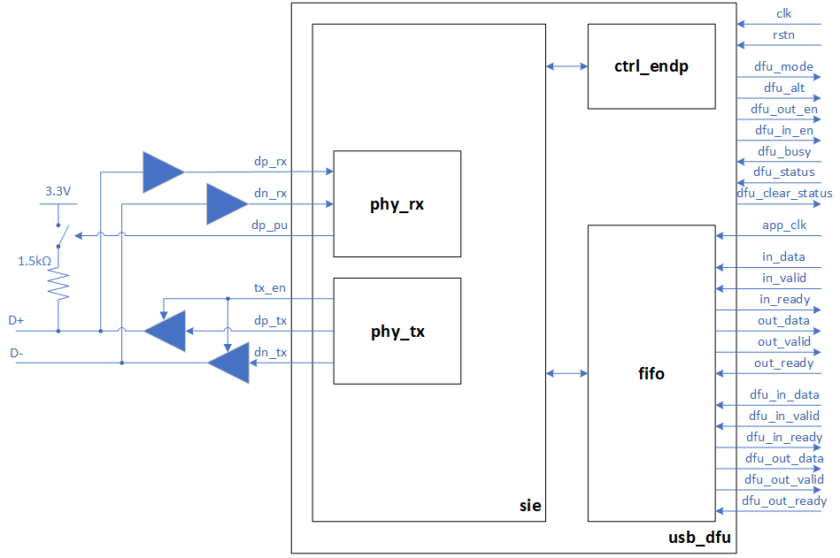
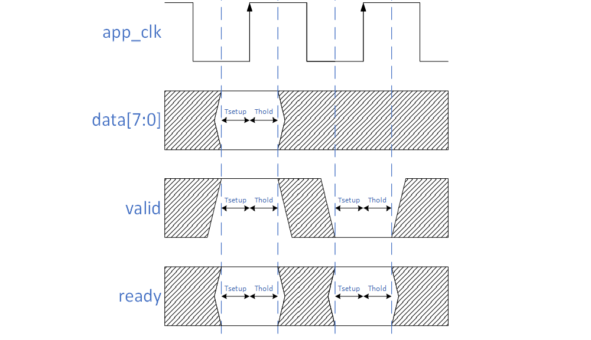
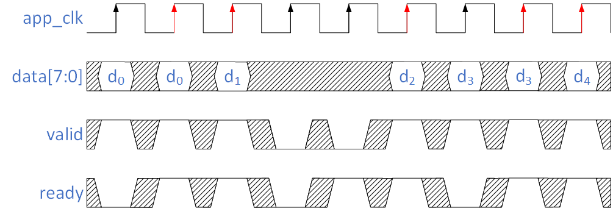
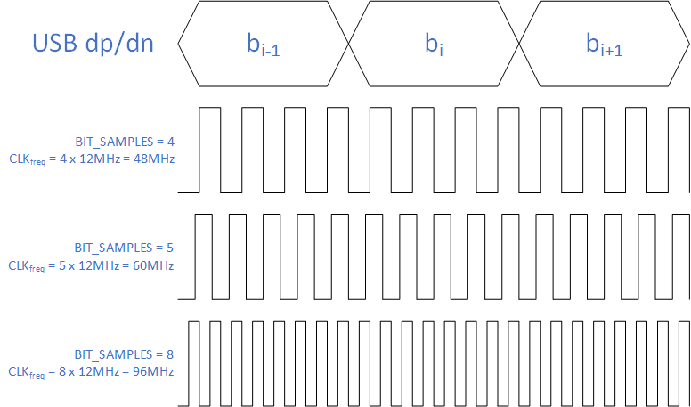

# USB\_DFU verilog module

USB\_DFU is a Verilog implementation of the USB Device Class Specification for Device Firmware Upgrade (DFU), version 1.1.

There are two functional device modes:

* Run-time. The device starts in this mode and implements the primary CDC/ACM function and a secondary DFU function that allows switching to DFU Mode through the only available DFU\_DETACH class request.
* DFU Mode. The device implements only the DFU function with all its class requests but the DFU\_DETACH one.

Windows 10/11, macOS, and Linux provide built-in drivers for CDC/ACM and DFU functions. These OSs automatically recognize them. Only Linux requires administrative intervention to grant permissions for a user account to access USB peripherals. DFU function can be accessed by using [`dfu-util`](https://dfu-util.sourceforge.net).

USB\_DFU is derived from [USB\_CDC](https://github.com/ulixxe/usb_cdc) by adding the DFU function.


## Applications
* Flash programming and RAM read/write capability for microcontrollers and soft cores. USB\_DFU takes little gate resources and no memories, leaving them for the CPU.
* Bootloaders. See the `bootloader` example for completely replacing the original TinyFPGA bootloader with one fully compatible with the `tinyprog` programmer and with DFU capability added.
* Etc, it is up to your imagination.

## Block Diagram and Pinout



### Clocks
* `clk_i`: clock with a frequency of 12MHz*BIT\_SAMPLES
* `app_clk_i`: asynchronous clock used if parameter `USE_APP_CLK = 1`

### Reset
* `rstn_i`: asynchronous reset, active low

### CDC/ACM FIFO out (from the USB host)
* `out_data_o`: data byte
* `out_valid_o`: valid control signal
* `out_ready_i`: ready control signal

### CDC/ACM FIFO in (to the USB host)
* `in_data_i`: data byte
* `in_valid_i`: valid control signal
* `in_ready_o`: ready control signal

### DFU FIFO out (from the USB host)
* `dfu_out_data_o`: data byte
* `dfu_out_valid_o`: valid control signal
* `dfu_out_ready_i`: ready control signal

### DFU FIFO in (to the USB host)
* `dfu_in_data_i`: data byte
* `dfu_in_valid_i`: valid control signal
* `dfu_in_ready_o`: ready control signal

### DFU related signals
* `dfu_mode_o`: 1 if device is in DFU Mode, 0 otherwise (`app_clk_i` sync-ed)
* `dfu_alt_o`: alternate interface setting (`clk_i` sync-ed)
* `dfu_out_en_o`: 1 during image download transfer, 0 otherwise (`app_clk_i` sync-ed)
* `dfu_in_en_o`: 1 during image upload transfer, 0 otherwise (`app_clk_i` sync-ed)
* `dfu_clear_status_o`: 1 to clear dfu\_status\_i (`app_clk_i` sync-ed)
* `dfu_blocknum_o`: wValue field of DFU\_DNLOAD/DFU\_UPLOAD requests (`clk_i` sync-ed)
* `dfu_busy_i`: 1 to make the USB Host wait for Poll Timeout (`app_clk_i` sync-ed)
* `dfu_status_i`: status resulting from the execution of DFU requests (`app_clk_i` sync-ed):
	* `0x0`. DFU request execution is still running.
	* `0xF`. DFU request execution finished without error.
	* DFU error code. DFU request execution finished with error (see table at page 21 of DFU 1.1 standard).

### USB I/O buffers
* `dp_rx_i`: D+ input bit stream
* `dn_rx_i`: D- input bit stream
* `dp_tx_o`: D+ output bit stream
* `dn_tx_o`: D- output bit stream
* `tx_en_o`: D+/D- output enable
* `dp_up_o`: 1.5k&Omega; D+ pullup enable

### USB device status
* `frame_o`: last received USB frame number (`clk_i` sync-ed)
* `configured_o`: 1 if USB device is in configured state, 0 otherwise (`clk_i` sync-ed)

## FIFO interface
USB\_DFU provides two FIFO interfaces to transfer data to/from FPGA application. One for the CDC/ACM function and the other for the DFU function. All `in_*` and `out_*` channels use the same transmission protocol.



Data is consumed on rising `app_clk` when both `valid` and `ready` signals are high (red up arrows on the picture). Tsetup and Thold depend on FPGA/ASIC technology.

The `valid` signal is high only when new data is available. After data is consumed and there is no new data available, the `valid` signal is asserted low.




## Verilog Configuration Parameters
USB\_DFU has few Verilog parameters that allow customizing some module features.

### VENDORID and PRODUCTID
VENDORID and PRODUCTID define USB vendor ID (VID) and product ID (PID).  
For TinyFPGA: VID=0x1D50 and PID=0x6130.  
By default, they are not defined (VENDORID=0x0000 and PRODUCTID=0x0000).

### RTI_STRING
Run-time DFU interface string. This will appear as "name" on `dfu-util`.

### SN_STRING
Serial number string. This will appear as "serial" on `dfu-util`.

### ALT_STRINGS
Concatenation of DFU Mode strings separated by "\000" or by "\n". These will appear as "name" for the various alternate interfaces on `dfu-util`. The number of these strings defines the number of available alternate settings.

### TRANSFER_SIZE
Maximum number of bytes that the device can accept for DFU\_DNLOAD/DFU\_UPLOAD requests.

### POLLTIMEOUT
Minimum time, in milliseconds, that the host should wait before sending a subsequent DFU\_GETSTATUS request. This is enforced when `dfu_busy_i` is high, otherwise it is internally set to 1ms.

### MS20
If 0 Microsoft OS 2.0 Descriptors are disabled, otherwise they are enabled for Run-time mode.

### WCID
If 0 Microsoft OS 1.0 Descriptors are disabled, otherwise they are enabled for DFU Mode.

### MAXPACKETSIZE
MAXPACKETSIZE defines maximum data payload size for IN and OUT control/bulk transactions. The allowable full-speed values are only 8, 16, 32, and 64 bytes. The default value is 8.

### BIT\_SAMPLES
BIT\_SAMPLES defines the number of samples taken on USB dp/dn lines for each bit. Full Speed USB has a bit rate of 12MHz, so the `clk` clock has to be BIT\_SAMPLES times faster. For example, the default value of 4 needs a `clk` frequency of 48MHz (see the picture below).



### USE\_APP\_CLK and APP\_CLK\_RATIO

USE\_APP\_CLK parameter configures if the FPGA application uses the same USB_CDC internal stuff clock (USE\_APP\_CLK = 0) or a different asynchronous one (USE\_APP\_CLK = 1). If  USE\_APP\_CLK = 0 then `app_clk` input is not used and can be connected to a constant value such as `1'b0`.

When USE\_APP\_CLK = 1, APP\_CLK\_RATIO parameter defines the ratio between `clk` and `app_clk` frequencies:

* APP\_CLK\_RATIO = freq(`clk`) / freq(`app_clk`)


To improve data throughput for lower `app_clk` frequencies, APP\_CLK\_RATIO parameter selects one of three different approaches to synchronize data that cross the two clock domains:

* APP\_CLK\_RATIO &ge; 8. FPGA application can exchange data at every `app_clk` cycle.

* 8 > APP\_CLK\_RATIO &ge; 4. FPGA application can exchange data at every 2 `app_clk` cycles.

* APP\_CLK\_RATIO < 4. FPGA application can exchange data at an average of 2\*2.5 `app_clk` cycles + 2\*2.5 `clk` cycles.


Overall, the USB Full-speed protocol caps data throughput to 1.5MB/s.
So, with freq(`clk`) &ge; 48MHz, data throughput is 1.5MB/s if freq(`app_clk`) > 1.5MHz, otherwise it is freq(`app_clk`) bytes.


## Examples
A few examples with complete implementation on TinyFPGA-BX are present in the `examples` directory. In addition, simulation testbenches are provided for each one.
 

## Directory Structure

```
.
├── README.md                            --> This file
├── usb_dfu                              --> USB_DFU verilog files
│   ├── ctrl_endp.v
│   ├── fifo.v
│   ├── in_fifo.v
│   ├── out_fifo.v
│   ├── phy_rx.v
│   ├── phy_tx.v
│   ├── sie.v
│   └── usb_dfu.v
└── examples                             --> Example designs
    └── TinyFPGA-BX
        ├── hdl
        │   ├── bootloader
        │   │   ├── bootloader.v         --> Top level (verilog)
        │   │   :
        │   │
        │   └── loopback
        │       ├── loopback.v           --> Top level (verilog)
        │       :
        │
        ├── iCEcube2                     --> iCEcube2 projects
        │   ├── bootloader
        │   │   ├── usb_dfu_sbt.project  --> iCEcube2 project file
        │   │   :
        │   │
        │   └── loopback
        │       ├── usb_dfu_sbt.project  --> iCEcube2 project file
        │       :
        │
        ├── OSS_CAD_Suite                --> OSS CAD Suite projects
        │   ├── Makefile
        │   ├── input
        │   │   ├── bootloader
        │   │   │   :
        │   │   └── loopback
        │   │       :
        │   │
        │   └── output
        │       :
        │
        └── python                       --> test files
            └── bootloader
                ├── run.py
                :
```
